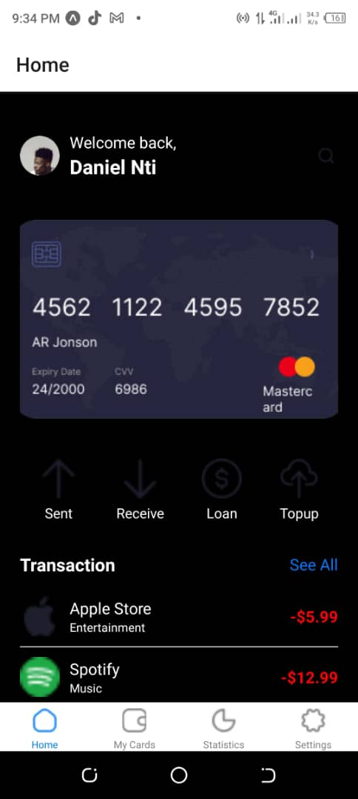

React Native Expo Mobile App
This is a React Native mobile application built using Expo. The app features a clean and user-friendly interface with the ability to switch between light and dark themes. The application includes Home, My Cards, Statistics, and Settings screens, each with its own functionality and custom styling.

Features
Home Screen: Displays user's card information, quick actions, and recent transactions.
My Cards Screen: Shows user's saved cards.
Statistics Screen: Displays user’s financial statistics.
Settings Screen: Allows users to change application settings, including toggling between light and dark themes.
Prerequisites
Node.js (>= 12.x.x)
npm or yarn
Expo CLI
Project Structure
my-project/

assets/
apple.png
Card.png
grocery.png
home.png
loan.png
moneyTransfer.png
myCards.png
profile.png
receive.png
search.png
send.png
settings.png
spotify.png
statistics.png
topUp.png
components/
CustomCard.js
QuickAction.js
TransactionItem.js
screens/
HomeScreen.js
MyCardsScreen.js
SettingsScreen.js
StatisticsScreen.js
App.js
app.json
package.json
Installation
Clone the repository:

git clone https://github.com/Ntidaniel/rn-assignment5-1137328

Navigate to the project directory:

cd my-project

Install dependencies:

npm install or yarn install

Start the Expo server:

expo start

Usage
Ensure you have the Expo Go app installed on your mobile device.
Scan the QR code generated by the Expo server using the Expo Go app.
The app will load on your mobile device.
Theme Switching
The application supports light and dark themes. You can toggle between these themes on the Settings screen using the switch provided.

License
This project is licensed under the MIT License - see the LICENSE file for details.

Acknowledgements
React Native
Expo
Styled Components
React Navigation
Feel free to contribute to this project by creating pull requests or opening issues.

Screenshots
 
 
 
 
